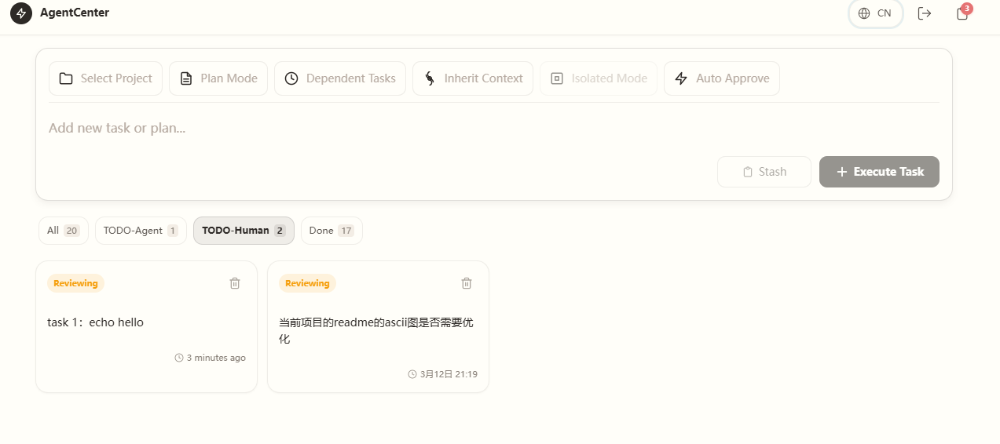
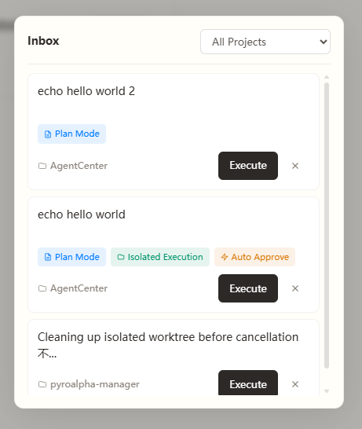
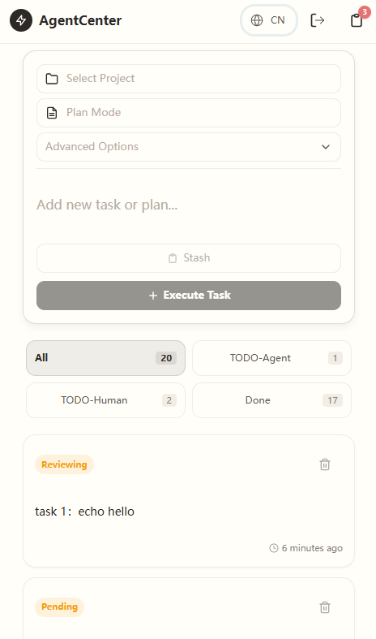

**🌐 Select Language / 选择语言:**
[English](README.en.md) | [简体中文](README.md)

---

# AgentCenter


*Figure 1: AgentCenter Main Interface - Task management and Agent status panel*

When you have multiple Agents executing different tasks, you need a place to see the status of each Agent: which ones are running, which are completed, which need human intervention — just like a command center.

AgentCenter provides **Agent/task status visualization, dependency orchestration, and execution isolation** — you only need to make decisions at key nodes.

> **Note**: The current version only supports **Claude Code CLI** as the execution Agent.

---

## Why This Project

### 1. Dependency Orchestration — Let it run automatically

> **Scenario**: Task B must wait for Task A to complete before it can start

```
Task A: 「Refactor Payment Module」(running)
         │
         └──→ Task B: 「Add Payment Logs」(queued, depends on Task A)

Task A completes → Task B starts automatically, no manual intervention needed
```


*Figure: Dependency Orchestration - Visual task dependency relationships*

**Without AgentCenter:**
- Manually watch when Task A completes
- Manually start Task B after completion
- Easy to forget, easy to break flow

**With AgentCenter:**
- Set up dependencies and forget about it
- Task B starts the moment Task A completes
- You can focus on other things

---

### 2. Pending Review Management — You only focus on what needs your decision

> **Scenario**: You have 3 projects, 20 tasks running, but only need to关注 3 that need human decisions

```
Task List (20 tasks):
├── TODO-Agent (15) - Agents executing, no need for you to manage
│   ├── Task 145: Refactor Payment Module (running)
│   ├── Task 146: Add Logs (queued, depends on Task 145)
│   └── ...
│
├── TODO-Human (3) - Needs your attention
│   ├── Task 147: Authentication Scheme Selection (reviewing) ← You are here
│   ├── Task 148: Database Selection Confirmation (reviewing) ← You are here
│   └── Task 149: Failed Task Review (failed) ← You are here
│
└── Completed (2)

You only need to filter TODO-Human in the frontend and handle these 3 tasks
The rest 17 tasks evolve automatically, no need to switch between multiple sessions
```


*Figure: Pending Review Management - TODO-Human filter, focus only on tasks needing human decisions*

**What this means:**
- Multiple projects, multiple Agents running in parallel, you only focus on "pending review" tasks
- No need to switch between multiple Claude Code sessions
- Frontend filters TODO-Human, one-stop handling of all tasks requiring human decisions
- Status panel at a glance: which Agents are running, which completed, which need human intervention

---

### 3. Parallel Isolation — Multiple tasks running simultaneously, no interference

> **Scenario**: Developing multiple different features for the same project, need to keep them separate

**Without AgentCenter:**
- Manually `git worktree add` to create multiple workspaces for isolation
- Remember to manually merge, cleanup worktree and branches after each task completes
- Have to resolve merge conflicts yourself
- Want to run 3 tasks simultaneously? Remember which directory corresponds to which task

**With AgentCenter:**
- Check "Isolated Execution" when creating a task, automatically creates independent worktree
- After task completion, automatically merges to main branch, automatically cleans up worktree and branches
- When merge conflicts occur, preserves the scene, frontend displays reviewing status for your review
- You only make decisions at key nodes, leave the rest to the system

---

### 4. Temporary Ideas — 10 seconds to record when inspiration strikes

> **Scenario**: Suddenly think of an optimization idea, but busy with current work

```
You: "Should I add a retry mechanism to the payment flow?"
      ↓
Click "Save" → Save to Inbox
      ↓
Continue with current work
      ↓
When free, retrieve from Inbox → Convert to task → Execute
```


*Figure: Temporary Ideas - Inbox card list, record inspiration anytime*

**Key points:**
- Mobile web access anytime
- Record ideas in just 10 seconds
- Does not interrupt current workflow

---

### 5. Mobile Management — Pull out your phone and check

> **Scenario**: Away from computer, want to check task progress

```
On the subway / In a cafe / In bed
      ↓
Pull out phone, open browser
      ↓
- Check which tasks are running
- Approve plans waiting for confirmation
- Review failed tasks
- New inspiration? Save it directly
```


*Figure: Mobile Management - Responsive mobile interface, manage tasks anywhere*

**Key points:**
- Responsive design, mobile-friendly experience
- Real-time log push, progress visible anytime
- No need to open computer, control center in your pocket

## Core Value

| **Feature** | **Problem Solved** |
|------|-----------|
| **Dependency Orchestration** | Task 1 auto-triggers Task 2 on completion, no manual watching needed |
| **Pending Review Management** | Multi-project multi-Agent parallel, only focus on tasks needing human intervention |
| **Parallel Isolation** | Multiple tasks executing simultaneously, no interference, no switching |
| **Idea Inbox** | Record inspiration on mobile anytime, does not interrupt current work |
| **Mobile Management** | Away from computer, still check progress, approve plans anytime |

> You only focus on what needs your decision, leave the rest to the system.

---

## How It Works

```
You: "Change user authentication to JWT, and update the docs too"

AgentCenter:
┌────────────────────────────────────────────────────┐
│ Task 1: Refactor Authentication Module              │
│ Agent #1 Status: running (Claude CLI executing)     │
│ Isolation: worktrees/AgentCenter-task-145/          │
│ Logs: Real-time streaming output →                  │
└────────────────────────────────────────────────────┘
      ↓ Task 1 completes
┌────────────────────────────────────────────────────┐
│ Task 2: Update Authentication Docs (depends on 1)   │
│ Agent #2 Status: queued → running (auto-start)      │
│ Context Reuse: Continue based on Task 1's history   │
└────────────────────────────────────────────────────┘
      ↓ Task 2 completes
┌────────────────────────────────────────────────────┐
│ Auto Merge: git merge task-145 → main               │
│ Auto Cleanup: worktrees/AgentCenter-task-145/ 🗑️    │
│ Auto Delete: task-145 branch 🗑️                     │
└────────────────────────────────────────────────────┘

You: See real-time status of each Agent in the frontend

┌─────────────────────────────────────────────────────────┐
│  [All 12]  [TODO-Agent 5]  [TODO-Human 3]  [Done 4]    │
└─────────────────────────────────────────────────────────┘

- Switch to TODO-Human, handle tasks needing your approval or review
- Let the rest Agents execute on their own, no need for you to manage
```

**Status Visualization · Dependency Orchestration · Execution Isolation** — One dashboard, see clearly what all Agents are doing, and which tasks need your intervention.

---

## Quick Start

### Prerequisites

AgentCenter is built on **Claude Code CLI**, please ensure the following dependencies are installed:

**1. Install Claude Code CLI (Required)**

```bash
npm install -g @anthropic-ai/claude-code

# Verify installation
claude --version
```

**2. Node.js 18+**

Frontend is based on Next.js 14, requires Node.js 18 or higher.

**3. Python 3.10+**

Backend is based on FastAPI, requires Python 3.10 or higher.

**4. Configure Environment Variables**

Copy and configure environment variable files:

```bash
# Backend configuration
cp backend/.env.example backend/.env

# Edit backend/.env, main configuration items:
# - MAX_CONCURRENT=5        # Maximum concurrent tasks
# - PASSWORD=your_password  # Login password (optional, no login required if not set)
# - SESSION_MAX_AGE=86400   # Session validity period (seconds)
# - DB_PATH=backend/task_manager.db  # Database path
# - TASK_TIMEOUT=3600       # Task timeout (seconds)
# - POST_PROCESS_TIMEOUT=600 # Post-processing timeout (seconds)

# Frontend configuration
cp frontend/.env.example frontend/.env

# Edit/frontend/.env, main configuration items:
# - NEXT_PUBLIC_API_DOMAIN=http://localhost:8010     # Backend API address
# - NEXT_PUBLIC_WS_DOMAIN=ws://localhost:8010        # WebSocket address
```

---

### Local Development

```bash
# Backend
cd backend
uv sync
uvicorn app:app --host 0.0.0.0 --port 8010

# Frontend
cd frontend
npm install
npm run dev    # http://localhost:3010
```

### Network Access Configuration

After starting the service, you can access via:

| Device | Address |
|------|------|
| Local Browser | `http://localhost:3010` or `http://<local-IP>:3010` |
| Mobile/Tablet | `http://<local-IP>:3010` |
| LAN Devices | `http://<local-IP>:3010` |

**Get Local IP:**

```bash
# Windows
ipconfig | findstr "IPv4"

# Linux
hostname -I | awk '{print $1}'

# macOS
ipconfig getifaddr en0
```

Backend will automatically print local IP address on startup:
```
Access URLs:
  Local:   http://localhost:8010
  Network: http://192.168.1.100:8010
```

**Common Issues:**

**Q: Phone cannot access?**

1. Confirm phone and computer are on the same WiFi network
2. Check if firewall has opened ports 8010 (backend) and 3010 (frontend)
3. Modify `NEXT_PUBLIC_API_DOMAIN` in `frontend/.env` to `http://<local-IP>:8010`
4. Modify `NEXT_PUBLIC_WS_DOMAIN` in `frontend/.env` to `ws://<local-IP>:8010`

**Q: How to open ports in Windows Firewall?**

Run PowerShell as Administrator:
```powershell
# Open backend port 8010
netsh advfirewall firewall add rule name="AgentCenter Backend" dir=in action=allow protocol=TCP localport=8010

# Open frontend port 3010
netsh advfirewall firewall add rule name="AgentCenter Frontend" dir=in action=allow protocol=TCP localport=3010
```

**Q: How to open ports in Linux Firewall?**

```bash
# Ubuntu/Debian (UFW)
sudo ufw allow 8010/tcp
sudo ufw allow 3010/tcp

# CentOS/RHEL (firewalld)
sudo firewall-cmd --permanent --add-port=8010/tcp
sudo firewall-cmd --permanent --add-port=3010/tcp
sudo firewall-cmd --reload
```

> **Note**: `0.0.0.0` listening will expose to LAN, make sure to use in trusted networks.
> Production environment should use reverse proxy (Nginx/Caddy) and configure HTTPS.

### Docker Compose [To be improved]

```bash
# 1. Clone repository
git clone https://github.com/zhengzc06/agent-center.git
cd agent-center

# 2. Configure environment variables (optional)
echo "PASSWORD=your_password" > .env
echo "MAX_CONCURRENT=5" >> .env

# 3. One-click start
docker-compose up -d

# 4. Access frontend
open http://localhost:3010
```

---

## Creating Tasks

### Frontend Configuration Bar

When creating tasks in the frontend, you can configure the following options:

| Configuration | Purpose |
|------|------|
| 📁 Project | Select the project for the task |
| ⚡ Execute\|Plan | Direct execution or generate plan first, then execute |
| 🔗 Dependent Tasks | Select incomplete tasks as prerequisites; the new task will wait for dependent tasks to complete before executing |
| 🔀 Inherit Context | Select completed tasks from the same project to reuse context |
| 💡 Isolated Execution | Execute in isolated environment. Git projects use Git worktree branches (parallel execution without conflicts); standalone tasks use separate directories (security isolation). |
| ✅ Auto Approve | Auto-approve after task completion, skip review |

### API Parameters

```python
# POST /api/tasks
{
  "prompt": "Refactor authentication module",  # Command for Claude Code to execute
  "mode": "execute" | "plan",                 # Direct execution or generate plan first
  "project_id": 1,                            # Parent project
  "depends_on_task_ids": [123, 124],          # List of dependent task IDs
  "fork_from_task_id": 123,                   # Reuse context from which task
  "is_isolated": true,                        # Whether to use worktree isolation
  "auto_approve": true,                       # Whether to auto-execute
}
```

---

## Core Features

### 1. Dependency Orchestration · Auto Scheduling

```
Task A: Refactor Payment Module (running)
         │
         ├──→ Task B: Add Payment Logs (queued, waiting for A)
         │          │
         │          └──→ Task D: Send Payment Notification (queued, waiting for B)
         │
         └──→ Task C: Update Payment Docs (queued, waiting for A)

Scheduler scans every 5 seconds:
1. Check queued tasks
2. Dependencies satisfied → Assign Worker to execute
3. Dependencies not satisfied → Continue waiting
```

**Frontend Smart Filter:**
```
┌─────────────────────────────────────────────────────────┐
│  [All 12]  [TODO-Agent 5]  [TODO-Human 3]  [Done 4]     │
└─────────────────────────────────────────────────────────┘
```
- **All**: Show all tasks
- **TODO-Agent**: Tasks being executed or queued by Agents
- **TODO-Human**: Tasks waiting for your approval or review (Plan mode/failed tasks)
- **Done**: Completed tasks

---

### 2. Inbox · Idea Staging Area

**From Inbox to Task:**

1. Click "Execute" button on Inbox card in frontend
2. Configure execution parameters (project, mode, dependency, Fork, etc.) - See [Creating Tasks](#creating-tasks)
3. Choose "Execute Task" to run immediately

**Difference between Inbox and regular todos:**

| Regular Todo | AgentCenter Inbox |
|----------|-----------------|
| Forget after recording | Execute when the time is right |
| Manual start | One-click convert to executable task |
| No context | Comes with dependencies, project, execution mode |

**Applicable Scenarios:**
- Sudden inspiration, don't want to interrupt current work
- Ideas that need to wait for dependency tasks to complete before executing
- Record on mobile anytime, batch process when back at computer

---

### 3. Context Reuse · Stand on existing conversations

```
Task 123: "Add User Management" (completed)
          │
          └──→ Fork Context → Task 145: "Add Permission Control on top of User Management"
```

**Key point:** Reuse complete session context from a task, let Claude know what happened before.

**Typical Scenario:**
```
Task 123 (completed): Designed user table structure, created User model
       ↓ Fork
Task 145 (new): "Add user permission control"
       ↓
Claude knows where User model is, how it's designed
       ↓
Continue development on existing code base, no need to re-explain context
```

---

### 4. Plan Mode · Think clearly before acting

**Workflow:**
```
You: "Refactor entire authentication system" (select Plan mode)
     ↓
Claude: Generate detailed execution plan (Markdown format)
     ↓
You read plan in frontend → Click "Approve"
     ↓
Status: reviewing → execute (starts executing)
```

**Key points:**
- Use `--permission-mode plan` to let Claude only read code and output plan
- Plan displayed in frontend in Markdown format
- After approval, use `--resume` to continue executing original task

**Applicable Scenarios:** Large-scale refactoring, uncertain requirements, want to confirm solution before executing.

---

### 5. Parallel Isolation · Worktree

Each task executes in an independent working directory, code does not interfere.

**Isolation Mechanism:**

- **Git projects**: Creates git worktree at `worktrees/<project>-task-<id>/`
- **Standalone tasks**: Creates regular directory at `worktrees/standalone-{task_id}/`
- **Auto Cleanup**: Automatically cleans up working directory after task completion

**Workflow:**

```
Create task (check Isolation) → Auto create independent working directory
         ↓
Claude Code executes in directory (--add-dir)
         ↓
Task complete → Status: reviewing (waiting for approval)
         ↓
User approves → Post-processing starts
         ↓
Git projects: git merge + cleanup worktree
Standalone tasks: Direct delete directory
         ↓
Status: completed
```

**Merge Conflict Handling:**

- If merge encounters conflict, post-processing flow preserves worktree for manual resolution
- Frontend task status displays as `reviewing`, user can review and retry

**Integration with Claude Code:**

AgentCenter uses `--add-dir` parameter to let Claude Code execute in the designated working directory,
achieving natural file isolation.

---

### 6. Mobile First · Responsive Design

Away from computer? Pull out your phone to manage tasks.

**Responsive Layout:**

| Device | Layout |
|------|------|
| Desktop | Centered modal, max-width 1280px |
| Mobile | Bottom drawer, draggable to close |

**Mobile Experience:**

- Real-time log push, progress visible anytime
- Touch-friendly large buttons and cards
- Pull to refresh task list
- Mobile web access anytime, no App installation needed

**Applicable Scenarios:**

- Check task progress on subway
- Approve waiting plans in cafe
- Review failed tasks in bed
- New inspiration? Save directly to Inbox

---

## Architecture Overview

```
┌─────────────────────────────────────────────────────┐
│                  Frontend (Next.js 14)                │
│  ┌─────────┐  ┌─────────┐  ┌─────────┐  ┌─────────┐ │
│  │TaskInput│  │UnifiedList│  │TaskDrawer│  │PlanDrawer│ │
│  │(Config) │  │(TaskCard) │  │(LogStream)│ │(PlanApproval)│ │
│  └─────────┘  └─────────┘  └─────────┘  └─────────┘ │
└─────────────────────┬───────────────────────────────┘
                      │ HTTP (REST) + WebSocket (Logs)
┌─────────────────────▼───────────────────────────────┐
│                  Backend (FastAPI)                    │
│  ┌─────────────────────────────────────────────────┐│
│  │            Ralph Loop Scheduler                  ││
│  │  Scan every 5s → Check dependencies → Assign    ││
│  │  Worker → Monitor execution                      ││
│  └─────────────────────────────────────────────────┘│
│  ┌─────────────────┐  ┌─────────────────────────┐   │
│  │ Worktree Service│  │ Runner Service (Agent Executor)││
│  │ Git Isolation   │  │ --fork-session          │   │
│  │ Create/Merge/   │  │ --resume                │   │
│  │ Cleanup         │  │ --add-dir               │   │
│  │                 │  │ --permission-mode       │   │
│  └─────────────────┘  └─────────────────────────┘   │
└─────────────────────┬───────────────────────────────┘
                      │
┌─────────────────────▼───────────────────────────────┐
│SQLite (WAL Mode) + Agent Executor (Current: Claude Code CLI)│
└─────────────────────────────────────────────────────┘
```

**Core Data Flow:**

```
1. User creates task → POST /api/tasks
2. Task saved to database → Status: queued
3. Ralph Loop polls → Check dependencies → Assign Worker
4. Runner service starts Agent Executor → Status: running
5. Logs pushed via WebSocket → Frontend displays in real-time
6. Task complete → Status: completed / reviewing
7. Isolated task → Auto merge + cleanup worktree
```

---

## Project Structure

```
agent-center/
├── backend/
│   ├── app.py                 # FastAPI entry
│   ├── auth.py                # Session management
│   ├── config.py              # Configuration management
│   ├── db.py                  # Database connection
│   ├── middleware/            # Authentication middleware
│   ├── routes/                # API routes (tasks, inbox, projects, auth...)
│   ├── scheduler/             # Ralph Loop scheduler
│   ├── services/              # Core services (task, runner, worktree, dependency...)
│   └── utils/                 # Utility functions
│
├── frontend/
│   ├── app/                   # Next.js pages and layout
│   ├── components/            # UI components, lists, drawers
│   ├── lib/                   # API clients, Hooks, state management
│   ├── types/                 # TypeScript type definitions
│   └── middleware.ts          # Next.js middleware
│
├── docs/                      # Architecture and authentication design docs
└── docker-compose.yml         # Docker deployment configuration
```

---

## Design Philosophy & Future Directions

> **Let Agent do what it does best, AgentCenter handles the command and coordination behind the scenes.**

AgentCenter doesn't do code generation, smart completion, or project management—there are already better tools for those.

We focus on: **Agent/task status visualization, dependency orchestration, execution isolation**—so you can see at a glance what all Agents are doing, automatically handle dependency triggers, parallel isolation, and other chores. You only make decisions at key nodes.

**Future Directions:**

- [ ] Inbox smart suggestions (recommend based on historical tasks)
- [ ] Task execution history statistics (duration, success rate analysis)
- [ ] Webhook notifications (trigger custom callbacks on task completion)
- [ ] Task templates (one-click creation for common task types)
- [ ] Support more types of Agents

---

## Known Limitations

| Limitation | Impact | Workaround |
|------|------|------------|
| In-memory Session | Need to re-login after service restart | Sufficient for personal use |
| Single User | No multi-user/permission management | Personal project, no multi-user needed |
| SQLite | Limited high-concurrency writes | Sufficient for personal use |
| Worktree Auto-Merge/Cleanup | Occasionally Agent may not complete merge or cleanup properly, requiring manual intervention | Review task status, manually execute git commands to complete merge or cleanup |

---

## License

MIT