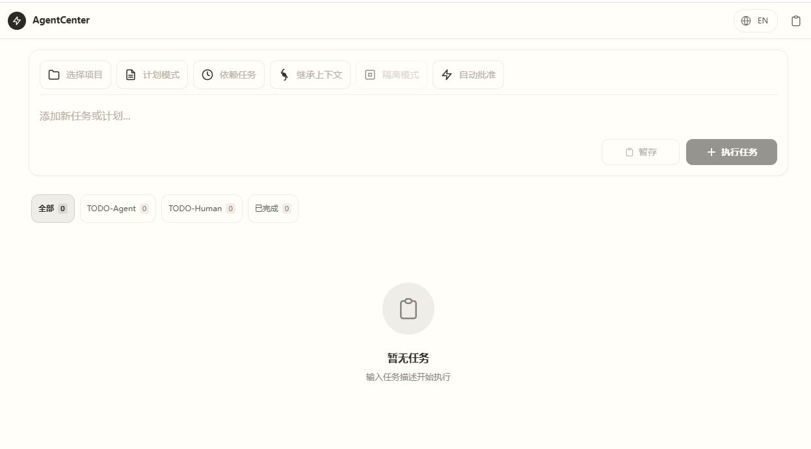
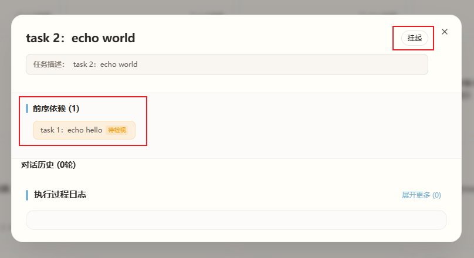
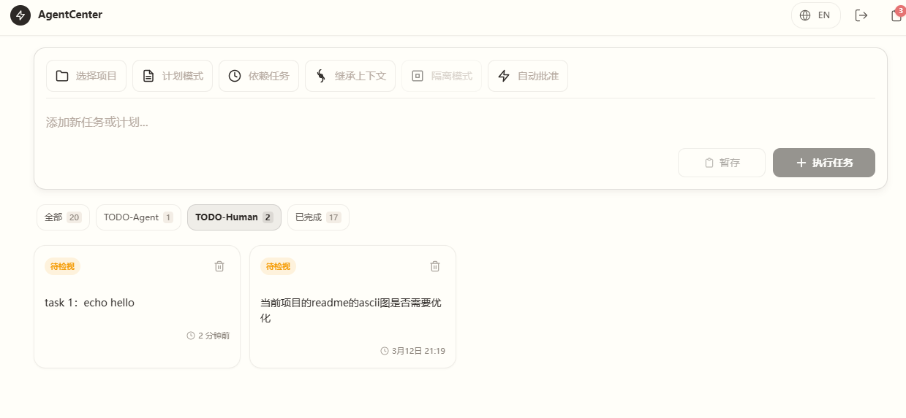
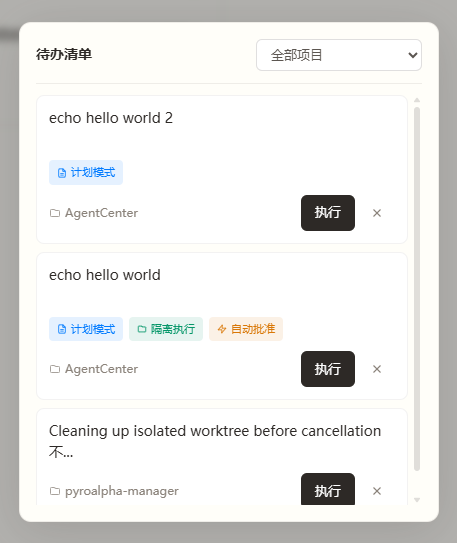
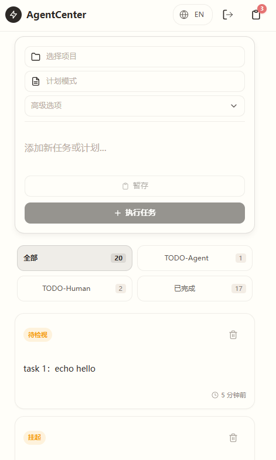

**🌐 选择语言 / Select Language:**
[简体中文](README.md) | [English](README.en.md)

---
# AgentCenter


*图: AgentCenter 主界面 - 任务管理和 Agent 状态面板*

当你有多个 Agent 在执行不同任务，你需要一个地方来看到每个 Agent 的状态：哪些在跑、哪些完成了、哪些需要人类介入 —— 就像一个指挥中心。

AgentCenter 提供 **Agent/任务的状态可视化、依赖编排、执行隔离** —— 你只需要在关键节点做决策。

> **注**：当前版本仅支持接入 **Claude Code CLI** 作为执行 Agent。

---

## 为什么要做这个项目

### 1. 依赖编排 —— 一串事情，让它自己跑完

> **场景**：任务 B 要等任务 A 完成才能开始

```
任务 A: 「重构支付模块」(running)
         │
         └──→ 任务 B: 「添加支付日志」(queued，依赖任务 A)

任务 A 完成 → 任务 B 自动开始，无需手动干预
```


*图：依赖编排 - 任务依赖关系可视化*

**没有 AgentCenter 时：**
- 手动盯着任务 A 何时完成
- 完成后手动启动任务 B
- 容易忘记，容易打断心流

**有了 AgentCenter：**
- 设置好依赖关系，然后就不用管了
- 任务 A 完成瞬间，任务 B 立即开始
- 你可以安心做别的事

---

### 2. 待检视管理 —— 你只需要关注需要你决策的

> **场景**：你有 3 个项目、20 个任务在跑，但只需要关注其中 3 个需要人类决策的

```
任务列表 (20 个任务):
├── TODO-Agent (15 个) - Agent 自行执行中，无需你管
│   ├── 任务 145: 重构支付模块 (running)
│   ├── 任务 146: 添加日志 (queued，依赖任务 145)
│   └── ...
│
├── TODO-Human (3 个) - 需要你介入
│   ├── 任务 147: 认证方案选择 (reviewing) ← 你在这里
│   ├── 任务 148: 数据库选型确认 (reviewing) ← 你在这里
│   └── 任务 149: 失败任务检视 (failed) ← 你在这里
│
└── 已完成 (2 个)

你只需要在前端筛选出 TODO-Human，处理这 3 个任务
其余 17 个任务自行演进，无需你在多个会话间切换
```


*图：待检视管理 - TODO-Human 筛选器，只关注需要人类决策的任务*

**这意味着什么：**
- 多个项目、多个 Agent 并行，你只需要关注「待检视」的任务
- 无需在多个 Claude Code 会话间切换
- 前端筛选 TODO-Human，一站式处理所有需要人类决策的任务
- 状态面板一目了然：哪些 Agent 在跑、哪些完成了、哪些需要人类介入

---

### 3. 并行隔离 —— 多个任务同时跑，互不干扰

> **场景**：同一个项目开发多个不同特性，需要互不影响并行开发

**没有 AgentCenter 时：**
- 要实现隔离，得手动 `git worktree add` 创建多个工作区
- 每个任务完成后，要记得手动 merge、清理 worktree 和分支
- 合并冲突了还得自己找现场解决
- 想同时跑 3 个任务？得记住每个任务对应的目录

**有了 AgentCenter：**
- 创建任务时勾选「隔离执行」，自动创建独立 worktree
- 任务完成后自动 merge 到主分支，自动清理 worktree 和分支
- 合并冲突时保留现场，前端显示 reviewing 状态供你检视
- 你只需要在关键节点做决策，其余交给系统

---

### 4. 暂存想法 —— 灵感来时，10 秒记下来

> **场景**：突然想到一个优化点子，但手头还有事

```
你： 「要不要在支付流程里加个重试机制？」
      ↓
点击「暂存」→ 保存到 Inbox
      ↓
继续手头的工作
      ↓
有空闲时，从 Inbox 取出 → 转换为任务 → 执行
```


*图：暂存想法 - Inbox 卡片列表，灵感随时记录*

**关键：**
- 手机网页随时访问
- 记录想法只需 10 秒
- 不会打断当前工作流

---

### 5. 移动管理 —— 手机掏出来就能看

> **场景**：人不在电脑前，想看看任务进展

```
地铁上 / 咖啡厅 / 床上
      ↓
掏出手机，打开浏览器
      ↓
- 看看哪些任务正在跑
- 批准等待确认的计划
- 检视失败的任務
- 有新的灵感？直接暂存
```


*图：移动管理 - 手机端响应式界面，随时随地管理任务*

**关键：**
- 响应式设计，手机体验友好
- 实时日志推送，进展随时可见
- 不需要打开电脑，口袋里的控制中心

## 核心价值

| **功能** | **解决的问题** |
|------|-----------|
| **依赖编排** | 任务 1 完成后自动触发任务 2，无需手动盯着 |
| **待检视管理** | 多项目多 Agent 并行，只需要关注需要人类介入的任务 |
| **并行隔离** | 多个任务同时执行，互不干扰，无需切换 |
| **想法暂存** | 手机端随时记录灵感，不会打断当前工作 |
| **移动管理** | 人不在电脑前，也能随时查看进展、批准计划 |

> 你只需要关注需要你决策的，其余交给系统自行演进。

---

## 工作模式一览

```
你： 「把用户认证改成 JWT，顺便把文档也更新了」

AgentCenter:
┌────────────────────────────────────────────────────┐
│ 任务 1: 重构认证模块                                │
│ Agent #1 状态：running (Claude CLI 正在执行)         │
│ 隔离：worktrees/AgentCenter-task-145/                │
│ 日志：实时流式输出 →                              │
└────────────────────────────────────────────────────┘
      ↓ 任务 1 完成
┌────────────────────────────────────────────────────┐
│ 任务 2: 更新认证文档 (依赖任务 1)                    │
│ Agent #2 状态：queued → running (自动开始)           │
│ 上下文复用：基于任务 1 的对话历史继续                  │
└────────────────────────────────────────────────────┘
      ↓ 任务 2 完成
┌────────────────────────────────────────────────────┐
│ 自动合并：git merge task-145 → main                │
│ 自动清理：worktrees/AgentCenter-task-145/ 🗑️         │
│ 自动删除：task-145 分支 🗑️                          │
└────────────────────────────────────────────────────┘

你：在前端看到每个 Agent 的实时状态

┌─────────────────────────────────────────────────────────┐
│  [全部 12]  [TODO-Agent 5]  [TODO-Human 3]  [已完成 4]   │
└─────────────────────────────────────────────────────────┘

- 切换到 TODO-Human，处理需要你批准或检视的任务
- 其余 Agent 自行执行，无需你管
```

**状态可视化 · 依赖编排 · 执行隔离** —— 一个面板，看清所有 Agent 在干什么，以及你需要介入的任务。

---

## 快速开始

### 前置条件

AgentCenter 基于 **Claude Code CLI** 构建，请先确保以下依赖已安装：

**1. 安装 Claude Code CLI（必须）**

```bash
npm install -g @anthropic-ai/claude-code

# 验证安装
claude --version
```

**2. Node.js 18+**

前端基于 Next.js 14，需要 Node.js 18 或更高版本。

**3. Python 3.10+**

后端基于 FastAPI，需要 Python 3.10 或更高版本。

**4. 配置环境变量**

复制并配置环境变量文件：

```bash
# 后端配置
cp backend/.env.example backend/.env

# 编辑 backend/.env，主要配置项：
# - MAX_CONCURRENT=5        # 最大并发任务数
# - PASSWORD=your_password  # 登录密码（可选，未设置则免登录）
# - SESSION_MAX_AGE=86400   # Session 有效期（秒）
# - DB_PATH=backend/task_manager.db  # 数据库路径
# - TASK_TIMEOUT=3600       # 任务超时时间（秒）
# - POST_PROCESS_TIMEOUT=600 # 后处理超时时间（秒）

# 前端配置
cp frontend/.env.example frontend/.env

# 编辑 frontend/.env，主要配置项：
# - NEXT_PUBLIC_API_DOMAIN=http://localhost:8010     # 后端 API 地址
# - NEXT_PUBLIC_WS_DOMAIN=ws://localhost:8010        # WebSocket 地址
```

---

### 本地开发

```bash
# 后端
cd backend
uv sync
uvicorn app:app --host 0.0.0.0 --port 8010

# 前端
cd frontend
npm install
npm run dev    # http://localhost:3010
```

### 网络访问配置

启动服务后，可通过以下方式访问：

| 设备 | 地址 |
|------|------|
| 本机浏览器 | `http://localhost:3010` 或 `http://<本机 IP>:3010` |
| 手机/平板 | `http://<本机 IP>:3010` |
| 局域网其他设备 | `http://<本机 IP>:3010` |

**获取本机 IP：**

```bash
# Windows
ipconfig | findstr "IPv4"

# Linux
hostname -I | awk '{print $1}'

# macOS
ipconfig getifaddr en0
```

后端启动时会自动打印本机 IP 地址：
```
Access URLs:
  Local:   http://localhost:8010
  Network: http://192.168.1.100:8010
```

**常见问题：**

**Q: 手机无法访问？**

1. 确认手机和电脑在同一 WiFi 网络
2. 检查防火墙是否开放端口 8010（后端）和 3010（前端）
3. 修改 `frontend/.env` 中的 `NEXT_PUBLIC_API_DOMAIN` 为 `http://<本机 IP>:8010`
4. 修改 `frontend/.env` 中的 `NEXT_PUBLIC_WS_DOMAIN` 为 `ws://<本机 IP>:8010`

**Q: Windows 防火墙如何开放端口？**

以管理员身份运行 PowerShell：
```powershell
# 开放后端端口 8010
netsh advfirewall firewall add rule name="AgentCenter Backend" dir=in action=allow protocol=TCP localport=8010

# 开放前端端口 3010
netsh advfirewall firewall add rule name="AgentCenter Frontend" dir=in action=allow protocol=TCP localport=3010
```

**Q: Linux 防火墙如何开放端口？**

```bash
# Ubuntu/Debian (UFW)
sudo ufw allow 8010/tcp
sudo ufw allow 3010/tcp

# CentOS/RHEL (firewalld)
sudo firewall-cmd --permanent --add-port=8010/tcp
sudo firewall-cmd --permanent --add-port=3010/tcp
sudo firewall-cmd --reload
```

> **注意**：`0.0.0.0` 监听会暴露给局域网，请确保在受信任网络中使用。
> 生产环境请使用反向代理（Nginx/Caddy）并配置 HTTPS。

### Docker Compose[待完善]

```bash
# 1. 克隆项目
git clone https://github.com/zhengzc06/agent-center.git
cd agent-center

# 2. 配置环境变量（可选）
echo "PASSWORD=your_password" > .env
echo "MAX_CONCURRENT=5" >> .env

# 3. 一键启动
docker-compose up -d

# 4. 访问前端
open http://localhost:3010
```

---

## 创建任务

### 前端配置栏

在前端创建任务时，你可以配置以下选项：

| 配置 | 作用 |
|------|------|
| 📁 项目 | 选择任务所属项目 |
| ⚡ 执行\|计划 | 直接执行或生成计划后再执行 |
| 🔗 依赖任务 | 选择未完成的任务作为前置依赖，新任务会等待依赖任务完成后再执行。|
| 🔀 继承上下文 | 选择同项目已完成的任务复用上下文 |
| 💡 隔离执行 | 在隔离环境中执行。Git 项目使用 Git worktree 独立分支（多任务并行避免冲突）；独立任务在独立目录下执行（安全隔离）。 |
| ✅ 自动批准 | 任务完成后自动批准，跳过检视 |

### API 参数

```python
# POST /api/tasks
{
  "prompt": "重构认证模块",           # Claude Code 执行的指令
  "mode": "execute" | "plan",        # 直接执行 or 生成计划后再执行
  "project_id": 1,                   # 所属项目
  "depends_on_task_ids": [123, 124], # 依赖的任务 ID 列表
  "fork_from_task_id": 123,          # 复用哪个任务的上下文
  "is_isolated": true,               # 是否使用 worktree 隔离
  "auto_approve": true,              # 是否自动执行
}
```

---

## 核心功能

### 1. 依赖编排 · 自动调度

```
任务 A: 重构支付模块 (running)
         │
         ├──→ 任务 B: 添加支付日志 (queued，等待 A)
         │          │
         │          └──→ 任务 D: 发送支付通知 (queued，等待 B)
         │
         └──→ 任务 C: 更新支付文档 (queued，等待 A)

调度器每 5 秒扫描：
1. 检查 queued 状态的任务
2. 依赖满足 → 分配 Worker 执行
3. 依赖不满足 → 继续等待
```

**前端智能筛选：**
```
┌─────────────────────────────────────────────────────────┐
│  [全部 12]  [TODO-Agent 5]  [TODO-Human 3]  [已完成 4]   │
└─────────────────────────────────────────────────────────┘
```
- **全部**：显示所有任务
- **TODO-Agent**：Agent 正在执行或排队中的任务
- **TODO-Human**：等待你批准或检视的任务（Plan 模式/失败任务）
- **已完成**：已完成的任务

---

### 2. Inbox · 想法暂存区

**从 Inbox 到任务：**

1. 在前端点击 Inbox 卡片的「执行」按钮
2. 配置执行参数（项目、模式、依赖、Fork 等）- 参见 [创建任务](#创建任务)
3. 选择「执行任务」立即运行

**Inbox 与普通待办的区别：**

| 普通待办 | AgentCenter Inbox |
|----------|-----------------|
| 记下来就忘 | 等待合适的时机执行 |
| 手动开始 | 一键转换为可执行任务 |
| 没有上下文 | 带上依赖关系、项目、执行模式 |

**适用场景：**
- 突然的灵感，不想打断当前工作
- 需要等待依赖任务完成后再执行的想法
- 手机随时记录，回到电脑后批量处理

---

### 3. 上下文复用 · 站在已有对话基础上继续

```
任务 123: 「添加用户管理功能」 (已完成)
          │
          └──→ Fork 上下文 → 任务 145: 「在用户管理基础上添加权限控制」
```

**关键点：** 复用某个任务的完整会话上下文，让 Claude 知道之前发生了什么。

**典型场景：**
```
任务 123 (已完成): 设计了用户表结构，创建了 User 模型
       ↓ Fork
任务 145 (新建): "添加用户权限控制"
       ↓
Claude 知道 User 模型在哪里、怎么设计的
       ↓
直接在已有代码基础上继续开发，无需重新解释上下文
```

---

### 4. Plan 模式 · 想清楚再动手

**工作流程：**
```
你：「重构整个认证系统」(选择 Plan 模式)
     ↓
Claude: 生成详细执行计划（Markdown 格式）
     ↓
你在前端阅读计划 → 点击「批准」
     ↓
状态：reviewing → execute (开始执行)
```

**关键点：**
- 使用 `--permission-mode plan` 让 Claude 只读代码、输出计划
- 计划以 Markdown 格式展示在前端
- 批准后使用 `--resume` 继续执行原任务

**适用场景：** 大型重构、不确定需求、希望先确认方案再执行。

---

### 5. 并行隔离 · Worktree

每个任务在独立的工作目录中执行，代码互不干扰。

**隔离机制：**

- **Git 项目**：在 `worktrees/<project>-task-<id>/` 创建 git worktree
- **独立任务**：在 `worktrees/standalone-{task_id}/` 创建普通目录
- **自动清理**：任务完成后自动清理工作目录

**工作流程：**

```
创建任务 (勾选隔离) → 自动创建独立工作目录
         ↓
Claude Code 在工作目录中执行 (--add-dir)
         ↓
任务完成 → 状态：reviewing (等待批准)
         ↓
用户批准 → 后处理流程启动
         ↓
Git 项目：git merge + 清理 worktree
独立任务：直接删除目录
         ↓
状态：completed
```

**合并冲突处理：**

- 如果 merge 发生冲突，后处理流程会保留 worktree 供用户手动解决
- 前端任务状态显示为 `reviewing`，用户可检视后重试

**与 Claude Code 的集成：**

AgentCenter 使用 `--add-dir` 参数让 Claude Code 在指定的工作目录中执行任务，
实现天然的文件隔离。

---

### 6. 移动优先 · 响应式设计

人不在电脑前？掏出手机就能管理任务。

**响应式布局：**

| 设备 | 布局 |
|------|------|
| Desktop | 居中模态框，最大宽度 1280px |
| Mobile | 底部抽屉，可拖拽关闭 |

**移动端体验：**

- 实时日志推送，进展随时可见
- 触摸友好的大按钮和卡片
- 下拉刷新任务列表
- 手机网页随时访问，无需安装 App

**适用场景：**

- 地铁上查看任务进展
- 咖啡厅批准等待中的计划
- 床上检视失败的任务
- 有新的灵感？直接暂存到 Inbox

---

## 架构概览

```
┌─────────────────────────────────────────────────────┐
│                  前端 (Next.js 14)                    │
│  ┌─────────┐  ┌─────────┐  ┌─────────┐  ┌─────────┐ │
│  │TaskInput│  │UnifiedList│ │TaskDrawer│  │PlanDrawer│ │
│  │(配置栏)  │  │(任务卡片) │ │(日志流)  │  │(计划批准)│ │
│  └─────────┘  └─────────┘  └─────────┘  └─────────┘ │
└─────────────────────┬───────────────────────────────┘
                      │ HTTP (REST) + WebSocket (日志)
┌─────────────────────▼───────────────────────────────┐
│                  后端 (FastAPI)                       │
│  ┌─────────────────────────────────────────────────┐│
│  │            Ralph Loop 调度器                     ││
│  │  每 5 秒扫描 → 检查依赖 → 分配 Worker → 监控执行   ││
│  └─────────────────────────────────────────────────┘│
│  ┌─────────────────┐  ┌─────────────────────────┐   │
│  │ Worktree 服务   │  │ Runner 服务 (Agent 执行器)│   │
│  │ Git 隔离管理     │  │ --fork-session          │   │
│  │ 创建/合并/清理   │  │ --resume                │   │
│  └─────────────────┘  │ --add-dir               │   │
│                       │ --permission-mode       │   │
│                       └─────────────────────────┘   │
└─────────────────────┬───────────────────────────────┘
                      │
┌─────────────────────▼───────────────────────────────┐
│ SQLite (WAL 模式) + Agent 执行器 (当前：Claude Code CLI)│
└─────────────────────────────────────────────────────┘
```

**核心数据流：**

```
1. 用户创建任务 → POST /api/tasks
2. 任务存入数据库 → 状态：queued
3. Ralph Loop 轮询 → 检查依赖 → 分配 Worker
4. Runner 服务启动 Agent 执行器 → 状态：running
5. 日志通过 WebSocket 推送 → 前端实时显示
6. 任务完成 → 状态：completed / reviewing
7. 隔离任务 → 自动 merge + 清理 worktree
```

---

## 项目结构

```
agent-center/
├── backend/
│   ├── app.py                 # FastAPI 入口
│   ├── auth.py                # Session 管理
│   ├── config.py              # 配置管理
│   ├── db.py                  # 数据库连接
│   ├── middleware/            # 认证中间件
│   ├── routes/                # API 路由 (tasks, inbox, projects, auth...)
│   ├── scheduler/             # Ralph Loop 调度器
│   ├── services/              # 核心服务 (task, runner, worktree, dependency...)
│   └── utils/                 # 工具函数
│
├── frontend/
│   ├── app/                   # Next.js 页面和布局
│   ├── components/            # UI 组件、列表、抽屉
│   ├── lib/                   # API 客户端、Hooks、状态管理
│   ├── types/                 # TypeScript 类型定义
│   └── middleware.ts          # Next.js 中间件
│
├── docs/                      # 架构和认证设计文档
└── docker-compose.yml         # Docker 部署配置
```

---

## 设计理念与未来方向

> **让 Agent 做它擅长的事，AgentCenter 做好背后的指挥调度。**

AgentCenter 不做代码生成、智能补全、项目管理——这些已有更好的工具。

我们专注于：**Agent/任务的状态可视化、依赖编排、执行隔离**——让你一眼看清所有 Agent 在干什么，自动处理依赖触发、并行隔离等琐事，你只需要在关键节点做决策。

**未来方向：**

- [ ] Inbox 智能建议（基于历史任务推荐）
- [ ] 任务执行历史统计（耗时、成功率分析）
- [ ] Webhook 通知（任务完成时触发自定义回调）
- [ ] 任务模板（常用任务类型一键创建）
- [ ] 接入更多类型 Agent

---

## 已知限制

| 限制 | 影响 |  workaround |
|------|------|-------------|
| 内存 Session | 服务重启后需重新登录 | 个人使用场景足够 |
| 单体用户 | 无多用户/权限管理 | 个人项目，无需多用户 |
| SQLite | 高并发写入受限 | 个人使用场景足够 |
| Worktree 自动合并/清理 | 偶尔 Agent 无法很好完成合并或清理，需要人工手动介入 | 检视任务状态，手动执行 git 命令完成合并或清理 |

---

## 许可证

MIT