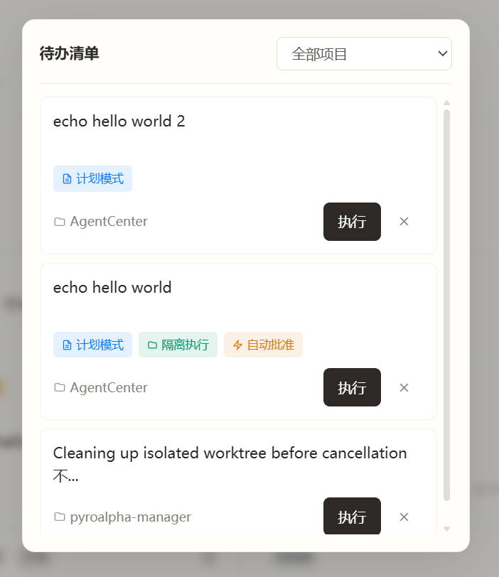

**🌐 选择语言 / Select Language:**
[简体中文](README.md) | [English](README.en.md)

---

# AgentCenter

**当你有多个 Agent 在执行不同任务，你需要一个指挥中心。**

AgentCenter 提供 **任务状态可视化、依赖编排、执行隔离** —— 让你一眼看清所有 Agent 在干什么，自动处理依赖触发、并行隔离等琐事，你只需要在关键节点做决策。

> 当前版本支持 **Claude Code CLI**，后续将接入更多 Agent

<div align="center">
  
  <br/>
  <small>图：AgentCenter 主界面 - 任务管理和 Agent 状态面板</small>
</div>

---

## 快速开始

### 本地部署（推荐）

**前置条件**：需先安装 Node.js、uv、Claude Code CLI，详见 [完整部署指南](#完整部署指南)

```bash
# 1. 克隆项目
git clone git@github.com:pyroalpha/agent-center.git
cd agent-center

# 2. 安装项目依赖（仅需一次）
npm run setup

# 3. 启动开发服务器
npm run dev
```

访问 http://localhost:3010

> **遇到问题？** 部署过程中如遇问题或需要详细步骤，请查看 [完整部署指南](#完整部署指南)

### Docker 部署（可选）

```bash
docker-compose up -d
```

访问 http://localhost:3010

> **需要配置？** 见 [常见问题 - Docker 运行时配置](#docker-运行时配置)

---

## 核心特性

| 特性 | 能帮你做什么 |
|------|-------------|
| **依赖编排** | 设置任务依赖关系，前置任务完成后自动触发后续任务，无需手动盯着 |
| **待检视管理** | 多项目多 Agent 并行时，只展示需要你决策的任务，其余自行演进 |
| **并行隔离** | 每个任务在独立 worktree 执行，代码互不干扰，自动合并清理 |
| **上下文复用** | 基于已有任务的完整会话历史继续执行，Agent 知道之前做了什么 |
| **Plan 模式** | 大型重构前先输出执行计划，批准后再动手，避免返工 |
| **移动友好** | 响应式设计，手机随时查看进展、批准计划、记录灵感 |

---

## 典型场景

### 场景 1：一串任务，让它自己跑完

> 适合：重构 + 文档更新、多步骤迁移等需要按顺序执行的任务

<div align="center">
  
  <br/>
  <small>图：依赖编排 - 任务 A 完成后自动触发任务 B</small>
</div>

**操作：**
1. 创建任务 A「重构支付模块」
2. 创建任务 B「添加支付日志」，设置依赖任务 A
3. 任务 A 完成后，任务 B 自动开始

---

### 场景 2：多项目并行，只关注需要你决策的

> 适合：同时开发多个特性，每个特性有多个任务

<div align="center">
  
  <br/>
  <small>图：待检视管理 - 只展示需要你介入的任务</small>
</div>

**操作：**
1. 为每个项目创建任务，勾选「隔离执行」
2. 切换到「TODO-Human」筛选器
3. 只处理需要你批准或检视的任务

---

### 场景 3：灵感来时，10 秒记下来

> 适合：突然有想法，不想打断当前工作

<div align="center">
  
  <br/>
  <small>图：Inbox 暂存 - 随时随地记录灵感</small>
</div>

**操作：**
1. 手机访问 Inbox 页面
2. 点击「暂存」，输入想法
3. 有空闲时，从 Inbox 一键转换为任务

---

## 部署选项

| 方式 | 适用场景 |
|------|----------|
| **本地部署** | 个人开发，快速启动 |
| **Docker 部署** | 生产环境，团队协作 |

### 本地部署

```bash
npm run setup
npm run dev
```

### Docker 部署

```bash
docker-compose up -d
```

> **需要详细步骤？** 见 [完整部署指南](#完整部署指南)
>
> **遇到问题？** 见 [常见问题](#常见问题)

---

## 架构概览

<details>
<summary>点击查看架构概览（可选阅读）</summary>

```
┌─────────────────────────────────────────────────────┐
│                  前端 (Next.js 14)                    │
│  ┌─────────┐  ┌─────────┐  ┌─────────┐  ┌─────────┐ │
│  │TaskInput│  │UnifiedList│ │TaskDrawer│  │PlanDrawer│ │
│  │(配置栏)  │  │(任务卡片) │ │(日志流)  │  │(计划批准)│ │
│  └─────────┘  └─────────┘  └─────────┘  └─────────┘ │
└─────────────────────┬───────────────────────────────┘
                      │ HTTP (REST) + WebSocket (日志)
┌─────────────────────▼───────────────────────────────┐
│                  后端 (FastAPI)                       │
│  ┌─────────────────────────────────────────────────┐│
│  │            Ralph Loop 调度器                     ││
│  │  每 5 秒扫描 → 检查依赖 → 分配 Worker → 监控执行   ││
│  └─────────────────────────────────────────────────┘│
│  ┌─────────────────┐  ┌─────────────────────────┐   │
│  │ Worktree 服务   │  │ Runner 服务 (Agent 执行器)│   │
│  │ Git 隔离管理     │  │ --fork-session          │   │
│  │ 创建/合并/清理   │  │ --resume                │   │
│  └─────────────────┘  │ --add-dir               │   │
│                       │ --permission-mode       │   │
│                       └─────────────────────────┘   │
└─────────────────────┬───────────────────────────────┘
                      │
┌─────────────────────▼───────────────────────────────┐
│ SQLite (WAL 模式) + Agent 执行器 (当前：Claude Code CLI)│
└─────────────────────────────────────────────────────┘
```

**核心数据流：**

```
1. 用户创建任务 → POST /api/tasks
2. 任务存入数据库 → 状态：queued
3. Ralph Loop 轮询 → 检查依赖 → 分配 Worker
4. Runner 服务启动 Agent 执行器 → 状态：running
5. 日志通过 WebSocket 推送 → 前端实时显示
6. 任务完成 → 状态：completed / reviewing
7. 隔离任务 → 自动 merge + 清理 worktree
```

</details>

---

## 项目结构

<details>
<summary>查看项目结构（可选阅读）</summary>

```
agent-center/
├── backend/
│   ├── app.py                 # FastAPI 入口
│   ├── auth.py                # Session 管理
│   ├── config.py              # 配置管理
│   ├── db.py                  # 数据库连接
│   ├── middleware/            # 认证中间件
│   ├── routes/                # API 路由 (tasks, inbox, projects, auth...)
│   ├── scheduler/             # Ralph Loop 调度器
│   ├── services/              # 核心服务 (task, runner, worktree, dependency...)
│   └── utils/                 # 工具函数
│
├── frontend/
│   ├── app/                   # Next.js 页面和布局
│   ├── components/            # UI 组件、列表、抽屉
│   ├── lib/                   # API 客户端、Hooks、状态管理
│   ├── types/                 # TypeScript 类型定义
│   └── middleware.ts          # Next.js 中间件
│
├── docs/                      # 架构和认证设计文档
└── docker-compose.yml         # Docker 部署配置
```

</details>

---

## 完整部署指南

<details>
<summary>查看完整部署指南</summary>

### 前置条件

AgentCenter 基于 **Claude Code CLI** 构建，请先确保以下依赖已安装：

**1. 安装 Claude Code CLI（必须）**

```bash
npm install -g @anthropic-ai/claude-code

# 验证安装
claude --version
```

**2. Node.js 18+**

前端基于 Next.js 14，需要 Node.js 18 或更高版本。

```bash
# 验证安装
node --version
```

**3. Python 3.10+ 与 uv**

后端基于 FastAPI，需要 Python 3.10 或更高版本，以及 `uv` 包管理器。

```bash
# 安装 uv（推荐）
curl -LsSf https://astral.sh/uv/install.sh | sh   # macOS/Linux
powershell -c "irm https://astral.sh/uv/install.ps1 | iex"  # Windows

# 验证安装
uv --version
```

### 配置环境变量

复制并配置环境变量文件：

```bash
# 后端配置
cp backend/.env.example backend/.env

# 编辑 backend/.env，主要配置项：
# - MAX_CONCURRENT=5        # 最大并发任务数
# - PASSWORD=your_password  # 登录密码（可选，未设置则免登录）
# - SESSION_MAX_AGE=86400   # Session 有效期（秒）
# - DB_PATH=backend/task_manager.db  # 数据库路径
# - TASK_TIMEOUT=3600       # 任务超时时间（秒）
# - POST_PROCESS_TIMEOUT=600 # 后处理超时时间（秒）

# 前端配置（本地开发）
cp frontend/.env.example frontend/.env

# 编辑 frontend/.env，主要配置项：
# - NEXT_PUBLIC_API_DOMAIN=http://localhost:8010     # 后端 API 地址
# - NEXT_PUBLIC_WS_DOMAIN=ws://localhost:8010        # WebSocket 地址
```

> **注意**：前端环境变量仅在本地开发时使用。生产环境（Docker 部署）使用**运行时配置**，无需构建时传入环境变量。

### 分别启动（可选）

如果需要在不同终端窗口分别控制前后端：

```bash
# 终端 1 - 后端
cd backend
uv sync
uvicorn app:app --host 0.0.0.0 --port 8010

# 终端 2 - 前端
cd frontend
npm install
npm run dev    # http://localhost:3010
```

日志输出示例：
```
[BACKEND] INFO:     Uvicorn running on http://0.0.0.0:8010
[FRONTEND] ready - started server on 0.0.0.0:3010
```

> **提示**：按 `Ctrl+C` 可同时停止前后端服务。

### Docker 运行时配置

前端支持**运行时环境变量注入**，无需构建时指定后端地址：

```bash
# 构建通用镜像（一次构建，多环境部署）
docker build -t agent-center:latest -f frontend/Dockerfile .

# 运行时指定后端地址
docker run -d --name ac-frontend \
  -p 3010:3010 \
  -e API_DOMAIN=http://backend:8010 \
  -e WS_DOMAIN=ws://backend:8010 \
  agent-center:latest
```

**配置说明：**
- `API_DOMAIN`: 后端 API 地址（必填）
- `WS_DOMAIN`: WebSocket 地址（必填）
- 配置通过 `/api/config` 端点动态注入到页面
- 前端自动读取配置并发送到正确的后端地址

</details>

---

## 常见问题

<details>
<summary>查看常见问题</summary>

### 网络访问配置

启动服务后，可通过以下方式访问：

| 设备 | 地址 |
|------|------|
| 本机浏览器 | `http://localhost:3010` 或 `http://<本机 IP>:3010` |
| 手机/平板 | `http://<本机 IP>:3010` |
| 局域网其他设备 | `http://<本机 IP>:3010` |

**获取本机 IP：**

```bash
# Windows
ipconfig | findstr "IPv4"

# Linux
hostname -I | awk '{print $1}'

# macOS
ipconfig getifaddr en0
```

后端启动时会自动打印本机 IP 地址：
```
Access URLs:
  Local:   http://localhost:8010
  Network: http://192.168.1.100:8010
```

**Q: 手机无法访问？**

1. 确认手机和电脑在同一 WiFi 网络
2. 检查防火墙是否开放端口 8010（后端）和 3010（前端）
3. 修改 `frontend/.env` 中的 `NEXT_PUBLIC_API_DOMAIN` 为 `http://<本机 IP>:8010`
4. 修改 `frontend/.env` 中的 `NEXT_PUBLIC_WS_DOMAIN` 为 `ws://<本机 IP>:8010`

### 防火墙配置

**Windows 防火墙**

以管理员身份运行 PowerShell：
```powershell
# 开放后端端口 8010
netsh advfirewall firewall add rule name="AgentCenter Backend" dir=in action=allow protocol=TCP localport=8010

# 开放前端端口 3010
netsh advfirewall firewall add rule name="AgentCenter Frontend" dir=in action=allow protocol=TCP localport=3010
```

**Linux 防火墙**

```bash
# Ubuntu/Debian (UFW)
sudo ufw allow 8010/tcp
sudo ufw allow 3010/tcp

# CentOS/RHEL (firewalld)
sudo firewall-cmd --permanent --add-port=8010/tcp
sudo firewall-cmd --permanent --add-port=3010/tcp
sudo firewall-cmd --reload
```

> **注意**：`0.0.0.0` 监听会暴露给局域网，请确保在受信任网络中使用。
> 生产环境请使用反向代理（Nginx/Caddy）并配置 HTTPS。

</details>

---

## 了解更多

- [架构设计文档](docs/architecture.md)

---

## 已知限制

| 限制 | 影响 |  workaround |
|------|------|-------------|
| 内存 Session | 服务重启后需重新登录 | 个人使用场景足够 |
| 单体用户 | 无多用户/权限管理 | 个人项目，无需多用户 |
| SQLite | 高并发写入受限 | 个人使用场景足够 |
| Worktree 自动合并/清理 | 偶尔 Agent 无法很好完成合并或清理，需要人工手动介入 | 检视任务状态，手动执行 git 命令完成合并或清理 |

---

## 许可证

MIT
